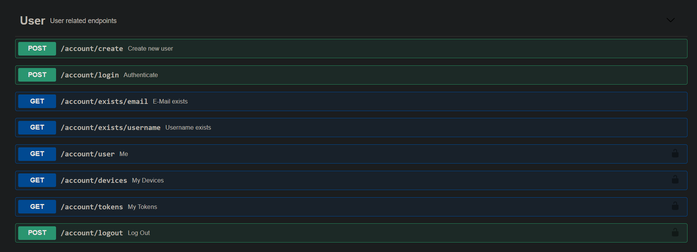
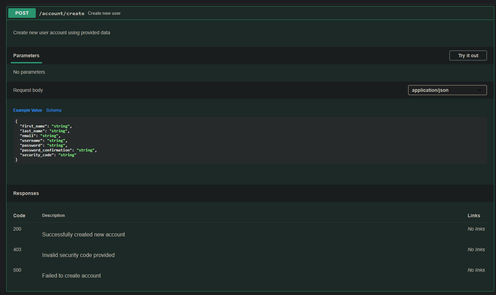

# Laravel OpenAPI
Simple to use OpenAPI 3 compatible documentation generator.  
Also includes OpenAPI UI.   
[](https://packagist.org/packages/freedomcore/laravel-openapi)
[](https://img.shields.io/static/v1?label=Sponsor%20freedomcore/laravel-openapi&message=%E2%9D%A4&logo=GitHub&link=https://github.com/sponsors/darki73)
## About
1. OAS3 support
2. Automatic generation (assuming relevant configuration option is turned on)
3. Includes of OpenAPI UI
4. Uses PHP 8 Attributes

## Requirements
This package developed on `Laravel 8.19.0`, but it might work on the previous releases.  
All other requirements are inherited from the `Laravel 8`.  
###PHP 8 is required for this package to work
## Installation
#### Install package through composer
```shell
composer require freedomcore/laravel-openapi
```
#### Publish configuration files and views
```shell
php artisan vendor:publish --provider "FreedomCore\OpenAPI\OpenAPIServiceProvider"
```
#### Edit the `openapi.php` configuration file for your liking

## What is included
Out of the box this package can work with `FormRequest`, it is also able to generate valid code for the method parameters when they are included in `query | path`, so there will be no duplicates
and `in: ****` will also be assigned correctly.

## Usage
### FreedomCore\\OpenAPI\\Attributes\\Controller
Controller attribute allows you to mark class as a Controller.  
This will help generator to recognize classes and create appropriate tags for routes.
```php
/**
 * Class User
 * @package App\Http\Controllers\User
 */
#[FreedomCore\OpenAPI\Attributes\Controller(
    name: 'User',
    description: 'User related endpoints'
)]
class User extends Controller {

}
```

### FreedomCore\\OpenAPI\\Attributes\\Request\\*
There are total of 5 types of requests currently supported by this package.  
- **FreedomCore\\OpenAPI\\Attributes\\Request\\Delete**
```php
/**
 * Delete constructor.
 * @param string $description
 * @param bool $deprecated
 */
public function __construct(string $description = '', bool $deprecated = false) {
    parent::__construct('DELETE', $description, $deprecated);
}
```  

- **FreedomCore\\OpenAPI\\Attributes\\Request\\Get**
```php
/**
 * Get constructor.
 * @param string $description
 * @param bool $deprecated
 */
public function __construct(string $description = '', bool $deprecated = false) {
    parent::__construct('GET', $description, $deprecated);
}
```  

- **FreedomCore\\OpenAPI\\Attributes\\Request\\Patch**
```php
/**
 * Patch constructor.
 * @param string $description
 * @param bool $deprecated
 */
public function __construct(string $description = '', bool $deprecated = false) {
    parent::__construct('PATCH', $description, $deprecated);
}
```  

- **FreedomCore\\OpenAPI\\Attributes\\Request\\Post**
```php
/**
 * Post constructor.
 * @param string $description
 * @param bool $deprecated
 */
public function __construct(string $description = '', bool $deprecated = false) {
    parent::__construct('POST', $description, $deprecated);
}
```  

- **FreedomCore\\OpenAPI\\Attributes\\Request\\Put**
```php
/**
 * Put constructor.
 * @param string $description
 * @param bool $deprecated
 */
public function __construct(string $description = '', bool $deprecated = false) {
    parent::__construct('PUT', $description, $deprecated);
}
```

You dont have to use these Attributes unless you want to add description to the resource, possible request types will be inferred from Laravel routing system.

### FreedomCore\\OpenAPI\\Attributes\\Response\\*
There are total of 18 types of responses currently supported by this package.  
They do come with the correct response codes attached to them, so the only thing you have to do (or not) is add description.

This is the base class:
```php
<?php namespace FreedomCore\OpenAPI\Attributes\Response;

use Attribute;

/**
 * Class Response
 * @package FreedomCore\OpenAPI\Attributes\Response
 */
#[Attribute(Attribute::TARGET_METHOD)]
class Response {

    /**
     * Response code
     * @var int
     */
    public int $code;

    /**
     * Response description
     * @var string
     */
    public string $description;

    /**
     * Response constructor.
     * @param int $code
     * @param string $description
     */
    public function __construct(int $code, string $description) {
        $this->code = $code;
        $this->description = $description;
    }

}
```

And this is the example of `FreedomCore\OpenAPI\Attributes\Response\Ok` response:
```php
<?php namespace FreedomCore\OpenAPI\Attributes\Response;

use Attribute;

/**
 * Class Ok
 * @package FreedomCore\OpenAPI\Attributes\Response
 */
#[Attribute(Attribute::TARGET_METHOD)]
class Ok extends Response {

    /**
     * Ok constructor.
     * @param string $description
     */
    public function __construct(string $description = '') {
        parent::__construct(200, $description);
    }

}
```

## Example `User.php` Controller
```php
<?php namespace App\Http\Controllers\User;

use App\Http\Requests\User\{
    AuthenticateRequest,
    CreateRequest,
    EmailRequest,
    UsernameRequest
};
use App\Http\Resources\User\{
    DeviceCollection,
    TokenCollection,
    UserResource
};
use Illuminate\Http\Request;
use Illuminate\Http\JsonResponse;
use FreedomCore\OpenAPI\Attributes;
use App\Http\Controllers\Controller;
use App\Contracts\Repositories\UserRepositoryContract;
use App\Contracts\Repositories\UserDeviceRepositoryContract;

/**
 * Class User
 * @package App\Http\Controllers\User
 */
#[Attributes\Controller(
    name: 'User',
    description: 'User related endpoints'
)]
class User extends Controller {

    /**
     * User repository instance
     * @var UserRepositoryContract
     */
    private UserRepositoryContract $userRepository;

    /**
     * User Device repository instance
     * @var UserDeviceRepositoryContract
     */
    private UserDeviceRepositoryContract $userDeviceRepository;

    /**
     * User constructor.
     * @param UserRepositoryContract $userRepository
     * @param UserDeviceRepositoryContract $userDeviceRepository
     */
    public function __construct(
        UserRepositoryContract $userRepository,
        UserDeviceRepositoryContract $userDeviceRepository
    ) {
        $this->userRepository = $userRepository;
        $this->userDeviceRepository = $userDeviceRepository;
    }

    /**
     * E-Mail exists
     * @param EmailRequest $request
     * @return JsonResponse
     */
    #[
        Attributes\Response\Ok(
            description: 'Successfully queried E-Mail existence'
        ),
        Attributes\Request\Get(
            description: 'Check whether specified E-Mail exists in the database'
        )
    ]
    public function existsEmail(EmailRequest $request): JsonResponse {
        return response()->success('Successfully queried E-Mail existence', [
            'exists'    =>  $this->userRepository->emailExists($request->get('email'))
        ]);
    }

    /**
     * Username exists
     * @param UsernameRequest $request
     * @return JsonResponse
     */
    #[
        Attributes\Response\Ok(
            description: 'Successfully queried Username existence'
        ),
        Attributes\Request\Get(
            description: 'Check whether specified Username exists in the database'
        )
    ]
    public function existsUsername(UsernameRequest $request): JsonResponse {
        return response()->success('Successfully queried Username existence', [
            'exists'    =>  $this->userRepository->usernameExists($request->get('username'))
        ]);
    }

    /**
     * Create new user
     * @param CreateRequest $request
     * @return JsonResponse
     */
    #[
        Attributes\Request\Post('Create new user account using provided data'),
        Attributes\Response\Ok('Successfully created new account'),
        Attributes\Response\Forbidden('Invalid security code provided'),
        Attributes\Response\InternalServerError('Failed to create account')
    ]
    public function create(CreateRequest $request): JsonResponse {
        return $this->userRepository->create($request);
    }

    /**
     * Authenticate
     * @param AuthenticateRequest $request
     * @return JsonResponse
     */
    #[
        Attributes\Request\Post('Authenticate user using provided credentials'),
        Attributes\Response\Ok('Successfully authenticated user using provided credentials'),
        Attributes\Response\Unauthorized('Invalid credentials provided'),
        Attributes\Response\InternalServerError('Failed to authenticate user due to internal server error')
    ]
    public function login(AuthenticateRequest $request): JsonResponse {
        return $this->userRepository->login($request, $this->userDeviceRepository);
    }

    /**
     * Log Out
     * @param Request $request
     * @return JsonResponse
     */
    #[
        Attributes\Request\Post('Log Out currently authenticated user'),
        Attributes\Response\Ok('Successfully logged out currently authenticated user'),
        Attributes\Response\InternalServerError('Failed to log out authenticated user due to internal server error')
    ]
    public function logout(Request $request): JsonResponse {
        return $this->userRepository->logout($request);
    }

    /**
     * Me
     * @param Request $request
     * @return UserResource
     */
    #[
        Attributes\Request\Get('Retrieve user information from request'),
        Attributes\Response\Ok('Successfully fetched information for currently authenticated user'),
        Attributes\Response\Forbidden('Invalid authorization token provided'),
        Attributes\Response\InternalServerError('Failed to fetch information for authenticated user due to internal server error')
    ]
    public function user(Request $request): UserResource {
        return new UserResource($this->userRepository->fromRequest($request));
    }

    /**
     * My Devices
     * @param Request $request
     * @return DeviceCollection
     */
    #[
        Attributes\Request\Get('Get list of devices associated with account'),
        Attributes\Response\Ok('Successfully fetched list of devices for currently authenticated user'),
        Attributes\Response\Forbidden('Invalid authorization token provided'),
        Attributes\Response\InternalServerError('Failed to fetch devices list for authenticated user due to internal server error')
    ]
    public function devices(Request $request): DeviceCollection {
        return new DeviceCollection($this->userDeviceRepository->forUser($request->user()));
    }

    /**
     * My Tokens
     * @param Request $request
     * @return TokenCollection
     */
    #[
        Attributes\Request\Get('Get list of tokens associated with account'),
        Attributes\Response\Ok('Successfully fetched list of tokens for currently authenticated user'),
        Attributes\Response\Forbidden('Invalid authorization token provided'),
        Attributes\Response\InternalServerError('Failed to fetch tokens list for authenticated user due to internal server error')
    ]
    public function tokens(Request $request): TokenCollection {
        return new TokenCollection($this->userRepository->tokens($request));
    }

}
```

And here is the WebUI look:


